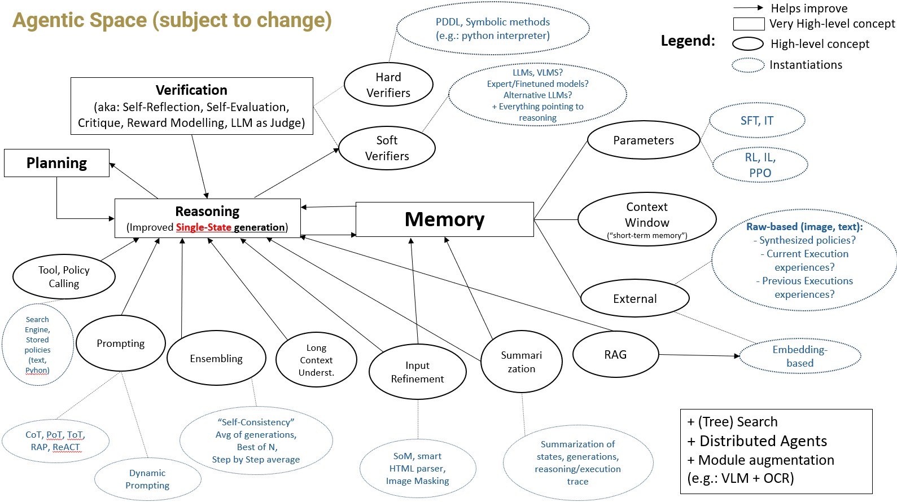

<!-- omit in toc -->
# Awesome-Reasoning-Action-LLMs-LMMs

This repo provides a list of papers and other for researchers interested in enhancing the performance of Large Language and Multimodal models (LLMMs) on tasks that require "reasoning" and "decision-making". This includes techniques aimed at static problems (e.g.: Math Q&A answering, static planning for BlocksWorld), as well as multi-step problems with environment interactions (e.g.: Web/GUI navigation; Embodied AI & Robotics).

The emphasis is on **inference-time techniques**, but some papers involving training have been included as well. 

**NOTES**
- This repo is **under construction**.
- The categorization of papers is intended as a general guide and is not perfect. Many papers span multiple categories and coule be included in more than one category - particularly those adopting agentic approaches.
- Check the spreadsheets for more papers, notes, git repos, webpags, etc.

<!-- omit in toc -->
## TODO
- [ ] Update Web/GUI Agents references and add to repo.
- [ ] Add remaining Reasoning-Acting references in spreadsheet to the list.
- [ ] Add github links.
- [ ] Add agents focused on memory, self-reflection, etc on their corresponding sections too (and vice-versa) (or avoid duplicate entries irrespective of the focus of the paper?)
- [ ] Add a 'grounding' category (?)
- [ ] Separate language-only from vision-language agents
- [ ] Add papers on Video understanding with relevant overlap (e.g.: MoReVQA: Exploring Modular Reasoning Models for Video Question Answering)
- [ ] Refine diagrams section; add soft disambiguation for high-level concepts (Reasoning, Planning)
- [ ] Upload code for spreadsheet-MD integration 
- [ ] check @TODO for more

<!-- omit in toc -->
## Overview
- [Diagram: Agentic Space](#diagram-agentic-space)
- [Prompting Techniques - Natural Language Emphasis](#prompting-techniques---natural-language-emphasis)
- [Prompting Techniques - Natural Language + Symbolic, Code](#prompting-techniques---natural-language--symbolic-code)
- [Planning - LLM Literature](#planning---llm-literature)
  - [Single-state plan generation + ~Hard Verifiers / External Knowledge](#single-state-plan-generation--hard-verifiers--external-knowledge)
- [Planning - Embodied AI literature](#planning---embodied-ai-literature)
  - [Static Planning](#static-planning)
  - [Dynamic Planning](#dynamic-planning)
- [Search](#search)
- [Verification (Critique, Self-Reflection, LLM as judge, reward models) - inference-time](#verification-critique-self-reflection-llm-as-judge-reward-models---inference-time)
  - [Critique with external knowledge injection](#critique-with-external-knowledge-injection)
- [Verification (Critique, Self-Reflection, LLM as judge, reward models) - training](#verification-critique-self-reflection-llm-as-judge-reward-models---training)
- [Memory \& Summarization](#memory--summarization)
  - [Synthesize and learn from experience](#synthesize-and-learn-from-experience)
  - [Summarization emphasis](#summarization-emphasis)
- [Retrieval](#retrieval)
- [Tool and Policy Usage](#tool-and-policy-usage)
- [Dynamic Prompting](#dynamic-prompting)
- [Modular Composition](#modular-composition)
- [Multimodal Reasoning](#multimodal-reasoning)
- [Theory, Explainability](#theory-explainability)
- [Training + CoT](#training--cot)
- [Analysis of LLMs and LMMs abilities](#analysis-of-llms-and-lmms-abilities)
  - [Analysis - Self-Critique](#analysis---self-critique)
  - [Analysis - Planning](#analysis---planning)
  - [Analysis - Prompting \& In-Context Learning](#analysis---prompting--in-context-learning)
- [Surveys \& Architectures](#surveys--architectures)
- [Agents - Web \& GUI Navigation](#agents---web--gui-navigation)
  - [Inference Time](#inference-time)
  - [Training - Grounded Models](#training---grounded-models)
  - [Training - Others](#training---others)
- [Benchmarks](#benchmarks)
  - [Q\&A Benchmarks, Language Reasoning](#qa-benchmarks-language-reasoning)
  - [Q\&A Benchmarks, Multimodal Reasoning](#qa-benchmarks-multimodal-reasoning)
  - [Planning Benchmarks, language (Static planning)](#planning-benchmarks-language-static-planning)
  - [Web](#web)
  - [OS or Multiple](#os-or-multiple)
    - [Virtual Environments](#virtual-environments)
    - [Q\&A-Like](#qa-like)
    - [Q\&A-Like, grounding](#qa-like-grounding)
    - [Video-based](#video-based)
  - [Mobile Navigation](#mobile-navigation)
  - [Robotics / Emobodied AI](#robotics--emobodied-ai)
  - [Memory](#memory)
- [Datasets](#datasets)
- [Frameworks / Abstractions](#frameworks--abstractions)
- [Courses, Workshops, and Talks](#courses-workshops-and-talks)
  - [Courses](#courses)
  - [Workshops \& Tutorials](#workshops--tutorials)
  - [Panels, Talks](#panels-talks)

## Diagram: Agentic Space
The literature in this area can be somewhat confusing, often filled with concepts that are difficult to define even for humans (e.g., "Reasoning") and marked by ambiguity/redundancy. Additionally, there is a wide range of techniques designed to enhance the performance of generative models, but it’s not always clear how these map to abstract notions like "Reasoning" or how they contribute to solving multistep decision-making problems.

The diagrams below is a tenative map of higher-level concepts such as "Reasoning" to lower-level instantiations of techniques such as RAG or Chain-of-Thought Prompting.

Of course, others may have different mental frameworks. For alternative perspectives, see [CoALA](https://arxiv.org/abs/2309.02427) and [LLM Powered Autonomous Agents] and [LLM Powered Autonomous Agents](https://lilianweng.github.io/posts/2023-06-23-agent/) for other examples.

@TODO: add other diagrams and discussions on "Planning" and "Reasoning" as studied in LLM space.

## Prompting Techniques - Natural Language Emphasis
- Many-Shot In-Context Learning, arXiv, Apr 2024. \[[paper](https://arxiv.org/abs/2404.11018)\]
- Chain-of-Thought Reasoning Without Prompting, arXiv, Feb 2024. \[[paper](https://arxiv.org/abs/2402.10200)\]
- **HtT**: Large Language Models can Learn Rules, arXiv, Oct 2023. \[[paper](https://arxiv.org/abs/2310.07064)\]
- **Graph of Thoughts**: Solving Elaborate Problems with Large Language Models, arXiv, Aug 2023. \[[paper](https://arxiv.org/abs/2308.09687)\]
- **Tree of Thoughts**: "Deliberate Problem Solving with Large Language Models", arXiv, May 2023. \[[paper](https://arxiv.org/abs/2305.10601)\]
- **RAP**: "Reasoning with Language Models is Planning with World model", arXiv, May 2023. \[[paper](https://arxiv.org/abs/2305.14992)\]
- **Self-Polish**: "Enhance Reasoning in Large Language Models via Problem Refinement", arXiv, May 2023. \[[paper](https://arxiv.org/abs/2305.14497)\]
- **Plan-and-Solve Prompting**: Improving Zero-Shot Chain-of-Thought Reasoning by Large Language Models", arXiv, May 2023. \[[paper](https://arxiv.org/abs/2305.04091)\]
- "**Rethinking with Retrieval**: Faithful LLM Inference", arXiv, Dec 2022. \[[paper](https://arxiv.org/abs/2301.00303)\]
- **ReAct**: Synergizing Reasoning and Acting in Language Models, arXiv, Oct 2022. \[[paper](https://arxiv.org/abs/2210.03629)\]
- **Multilingual CoT**: "Language Models are Multilingual Chain-of-Thought Reasoners", arXiv, Oct 2022. \[[paper](https://arxiv.org/abs/2210.03057)\]
- **Decomposed Prompting**: A Modular Approach for Solving Complex Tasks, arXiv, Oct 2022 \[[paper](https://arxiv.org/abs/2210.02406)\]
- **Self-Ask prompting**: "Measuring and Narrowing the Compositionality Gap in Language Models", arXiv, Oct 2022. \[[paper](https://arxiv.org/abs/2210.03350)\]
- Complexity-Based Prompting for Multi-Step Reasoning, arXiv, Oct 2022. \[[paper](https://arxiv.org/abs/2210.00720)\]
- **Least-to-Most Prompting** Enables Complex Reasoning in Large Language Models, arXiv, May 2022. \[[paper](https://arxiv.org/abs/2205.10625)\]
- **Let's Think Step by Step**: "Large Language Models are Zero-Shot Reasoners", arXiv, May 2022. \[[paper](https://arxiv.org/abs/2205.11916)\]
- **Self-Consistency**: "Self-Consistency Improves Chain of Thought Reasoning in Language Models", arXiv, Mar 2022. \[[paper](https://arxiv.org/abs/2203.11171)\]
- **CoT**: Chain-of-Thought Prompting Elicits Reasoning in Large Language Models, arXiv, Jan 2022. \[[paper](https://arxiv.org/abs/2201.11903)\]
- Language Models are Few-Shot Learners, arXiv, May 2020. \[[paper](https://arxiv.org/abs/2005.14165)\]

## Prompting Techniques - Natural Language + Symbolic, Code
- Chain of Code: Reasoning with a Language Model-Augmented Code Emulator, arXiv, Dec 2023. \[[paper](https://arxiv.org/abs/2312.04474)\]
- Inductive Reasoning w/ Hypothesis Refinement, arXiv, Oct 2023 \[[paper](https://arxiv.org/abs/2310.08559)\]
- Faithful Chain-of-Thought Reasoning, arXiv, Jan 2023 \[[paper](https://arxiv.org/abs/2301.13379)\]
- PAL: Program-aided Language Models, arXiv, Nov 2022 \[[paper](https://arxiv.org/abs/2211.10435)\]
- Program of thoughts prompting, arXiv, Nov 2022. \[[paper](https://arxiv.org/abs/2211.12588)\]

## Planning - LLM Literature
- Planning with Large Language Models for Code Generation
- CodeR: Issue Resolving with Multi-Agent and Task Graphs, arXiv, Jun 2024 \[[paper](https://arxiv.org/abs/2406.01304)\]
- CoAct: A Global-Local Hierarchy for Autonomous Agent Collaboration, arXiv, Jun 2024 \[[paper](https://arxiv.org/abs/2406.13381)\]

### Single-state plan generation + ~Hard Verifiers / External Knowledge
- Robust Planning with LLM-Modulo Framework: Case Study in Travel Planning, arXiv, May 2024 \[[paper](https://arxiv.org/abs/2405.20625)\]
- Large Language Models Can Solve Real-World Planning Rigorously with Formal Verification Tools, arXiv, Apr 2024 \[[paper](https://arxiv.org/abs/2404.11891)\]
- **LLM Modulo**: LLMs Can't Plan, But Can Help Planning in LLM-Modulo Frameworks, arXiv, Feb 2024 \[[paper](https://arxiv.org/abs/2402.01817)\]
- **LLM+P:** Empowering Large Language Models with Optimal Planning Proficiency, arXiv, Apr 2023 \[[paper](https://arxiv.org/pdf/2304.11477)\]
- Leveraging Pre-trained Large Language Models to Construct and Utilize World Models for Model-based Task Planning, arXiv, May 2023 \[[paper](https://arxiv.org/abs/2305.14909)\]
- What's the Plan? Evaluating and Developing Planning-Aware Techniques for Language Models, arXiv, Feb 2024. [[paper]](https://arxiv.org/abs/2402.11489)

## Planning - Embodied AI literature

### Static Planning
- Language Models as Zero-Shot Planners: Extracting Actionable Knowledge for Embodied Agents., arXiv, Jan 2022 \[[paper](https://arxiv.org/abs/2201.07207)\]
- Do As I Can, Not As I Say: Grounding Language in Robotic Affordances, arXiv, Apr 2022. \[[paper](https://arxiv.org/abs/2204.01691)\]
- Code as Policies: Language Model Programs for Embodied Control, arXiv, Sep 2022. \[[paper](https://arxiv.org/abs/2209.07753)\]
- ProgPrompt: Generating Situated Robot Task Plans using Large Language Models, arXiv, Sep 2022. \[[paper](https://arxiv.org/abs/2209.11302)\]
- Plan-Seq-Learn: Language Model Guided RL for Solving Long Horizon Robotics Tasks, arXiv, May 2024. \[[paper](https://arxiv.org/abs/2405.01534)\]
- SayPlan: Grounding Large Language Models using 3D Scene Graphs for Scalable Robot Task Planning, arXiv, Jul 2023. [[paper]](https://arxiv.org/abs/2307.06135)

### Dynamic Planning
- Swiftsage: a generative agent with fast and slow thinking for complex interactive tasks., arXiv, May 2023 \[[paper](https://arxiv.org/abs/2305.17390)\]
- Scalable multi-robot collaboration with large language models: centralized or decentralized systems?, arXiv, Sep 2023 \[[paper](https://arxiv.org/abs/2309.15943)\]
- REFLECT: Summarizing Robot Experiences for FaiLure Explanation and CorrecTion, arXiv, Jun 2023 \[[paper](https://arxiv.org/abs/2306.15724)\]
- Chatgpt for robotics: design principles and model abilities., arXiv, May 2023 \[[paper](https://arxiv.org/pdf/2306.17582)\]
- Integrating Action Knowledge and LLMs for Task Planning and Situation Handling in Open Worlds, arXiv, May 2023 \[[paper](https://arxiv.org/abs/2305.17590)\]
- Tidybot: personalized robot assistance with large language models., arXiv, May 2023 \[[paper](https://arxiv.org/abs/2305.05658)\]
- Describe, explain, plan and select: interactive planning with llms enables open-world multitask agents., arXiv, Feb 2023 \[[paper](https://arxiv.org/abs/2302.01560)\]
- LLM-Planner: Few-Shot Grounded Planning for Embodied Agents with Large Language Models, arXiv, Dec 2022 \[[paper](https://arxiv.org/abs/2212.04088)\]
- CAPE: corrective actions from precondition errors using large language models., arXiv, Nov 2022 \[[paper](https://arxiv.org/pdf/2211.09935)\]
  - Obs: + symbolic (PDDL)
- Open-vocabulary Queryable Scene Representations for Real World Planning, arXiv, Sep 2022 \[[paper](https://arxiv.org/abs/2209.09874)\]
- Inner Monologue: Embodied Reasoning through Planning with Language Models, arXiv, Jul 2022 \[[paper](https://arxiv.org/abs/2207.05608)\]
- Pre-trained language models for interactive decision-making,, arXiv, Feb 2022 \[[paper](https://arxiv.org/pdf/2202.01771)\]

## Search
- **LLM-MCTS**: "Large Language Models as Commonsense Knowledge for Large-Scale Task Planning", arXiv, May 2023. \[[paper](https://arxiv.org/abs/2305.14078)\]
- Language Agent Tree Search Unifies Reasoning Acting and Planning in Language Models, arXiv, Oct 2023. \[[paper](https://arxiv.org/abs/2310.04406)\]
- Tree Search for Language Model Agents, arXiv, Oct 2023. \[[paper](https://arxiv.org/abs/2310.04406)\]
- WebDreamer: Is Your LLM Secretly a World Model of the Internet? Model-Based Planning for Web Agents, arXiv, Nov 2024. [paper](https://arxiv.org/abs/2411.06559)

## Verification (Critique, Self-Reflection, LLM as judge, reward models) - inference-time
- Toward Self-Improvement of LLMs via Imagination, Searching, and Criticizing, arXiv, Apr 2024 \[[paper](https://arxiv.org/abs/2404.12253)\]
- Learning From Mistakes Makes LLM Better Reasoner, arXiv, Oct 2023 \[[paper](https://arxiv.org/abs/2310.20689)\]
- Forward-Backward Reasoning in Large Language Models for Mathematical Verification, arXiv, Aug 2023 \[[paper](https://arxiv.org/abs/2308.07758)\]
- Self-Evaluation Guided Beam Search for Reasoning, arXiv, May 2023 \[[paper](https://arxiv.org/abs/2305.00633)\]
- LM vs LM: Detecting Factual Errors via Cross Examination, arXiv, May 2023 \[[paper](https://arxiv.org/abs/2305.13281)\]
- Large Language Models are not Fair Evaluators, arXiv, May 2023 \[[paper](https://arxiv.org/abs/2305.17926)\]
- Improving Factuality and Reasoning in Language Models through Multiagent Debate, arXiv, May 2023 \[[paper](https://arxiv.org/abs/2305.14325)\]
- Reflexion: Language Agents with Verbal Reinforcement Learning, arXiv, Mar 2023 \[[paper](https://arxiv.org/abs/2303.11366)\]
- Self-Refine: Iterative Refinement with Self-Feedback, arXiv, Mar 2023 \[[paper](https://arxiv.org/abs/2303.17651)\]
- Language models can solve computer tasks, arXiv, Mar 2023 \[[paper](https://arxiv.org/abs/2303.17491)\]
- GPTScore: Evaluate as You Desire, arXiv, Feb 2023 \[[paper](https://arxiv.org/abs/2302.04166)\]
- Large Language Models are Better Reasoners with Self-Verification, arXiv, Dec 2022 \[[paper](https://arxiv.org/abs/2212.09561)\]

### Critique with external knowledge injection
- Teaching Large Language Models to Self-Debug, arXiv, Apr 2023 \[[paper](https://arxiv.org/abs/2304.05128)\]
- CRITIC: Large Language Models Can Self-Correct with Tool-Interactive Critiquing, arXiv, May 2023 \[[paper](https://arxiv.org/abs/2305.11738)\]
- Rarr: Researching and revising what language models say, using language models., arXiv, Oct 2022 \[[paper](https://arxiv.org/abs/2210.08726)\]
- **LLM Modulo**: LLMs Can't Plan, But Can Help Planning in LLM-Modulo Frameworks, arXiv, Feb 2024 \[[paper](https://arxiv.org/abs/2402.01817)\]

## Verification (Critique, Self-Reflection, LLM as judge, reward models) - training
- Rewarding Progress: Scaling Automated Process Verifiers for LLM Reasoning, arXiv, Oct 2024 \[[paper](https://arxiv.org/pdf/2410.08146)\]
- LLaVA-Critic: Learning to Evaluate Multimodal Models, arXiv, Oct 2024 \[[paper](https://arxiv.org/abs/2410.02712)\]
- Self-Taught Evaluators, arXiv, Aug 2024 \[[paper](https://arxiv.org/abs/2408.02666)\]
- Self-Rewarding Language Models, arXiv, Jan 2024 \[[paper](https://arxiv.org/abs/2401.10020)\]
- Math-Shepherd: Verify and Reinforce LLMs Step-by-step without Human Annotations, arXiv, Dec 2023 \[[paper](https://arxiv.org/abs/2312.08935)\]
- Let's Verify Step by Step, arXiv, May 2023 \[[paper](https://arxiv.org/abs/2305.20050)\]
- Large Language Models Can Self-Improve At Web Agent Tasks, arXiv, May 2024. [[paper](https://arxiv.org/abs/2405.20309)]

## Memory & Summarization
- A Human-Inspired Reading Agent with Gist Memory of Very Long Contexts, arXiv, Feb 2024 \[[paper](https://arxiv.org/pdf/2402.09727)\]
- Think-in-Memory: Recalling and Post-thinking Enable LLMs with Long-Term Memory, arXiv, Nov 2023 \[[paper](https://arxiv.org/abs/2311.08719)\]
- Walking Down the Memory Maze: Beyond Context Limit through Interactive Reading, arXiv, Oct 2023 \[[paper](https://arxiv.org/abs/2310.05029)\]
- MemGPT: Towards LLMs as Operating Systems, arXiv, Oct 2023 \[[paper](https://arxiv.org/abs/2310.08560)\]
- PEARL: Prompting Large Language Models to Plan and Execute Actions Over Long Documents, arXiv, May 2023 \[[paper](https://arxiv.org/abs/2305.14564)\]
- MoT: Memory-of-Thought Enables ChatGPT to Self-Improve, arXiv, May 2023 \[[paper](https://arxiv.org/abs/2305.05181)\]
- Augmenting Language Models with Long-Term Memory, arXiv, Jun 2023 \[[paper](https://arxiv.org/abs/2306.07174)\]
- MemoryBank: Enhancing Large Language Models with Long-Term Memory, arXiv, May 2023 \[[paper](https://arxiv.org/abs/2305.10250)\]
- Ghost in the Minecraft: Generally Capable Agents for Open-World Environments via Large Language Models with Text-based Knowledge and Memory, arXiv, May 2023 \[[paper](https://arxiv.org/abs/2305.17144)\]
- Enhancing large language model with self-controlled memory framework, arXiv, Apr 2023 \[[paper](https://arxiv.org/abs/2304.13343)\]
- Relational Memory Augmented Language Models, arXiv, Jan 2022 \[[paper](https://arxiv.org/abs/2201.09680)\]

### Synthesize and learn from experience
- Agent Workflow Memory, arXiv, Sep 2024. \[[paper](https://arxiv.org/abs/2409.07429)\]
- ExpeL: LLM Agents Are Experiential Learners, arXiv, Aug 2023 \[[paper](https://arxiv.org/pdf/2308.10144)\]
- AutoGuide: Automated Generation and Selection of State-Aware Guidelines for Large Language Model Agents, arXiv, Mar 2024 \[[paper](https://arxiv.org/abs/2403.08978)\]
- Generative Agents: Interactive Simulacra of Human Behavior, arXiv, Apr 2023 \[[paper](https://arxiv.org/abs/2304.03442)\]
- Reflexion: Language Agents with Verbal Reinforcement Learning, arXiv, Mar 2023 \[[paper](https://arxiv.org/abs/2303.11366)\]
- Voyager: An Open-Ended Embodied Agent with Large Language Models, arXiv, May 2023 \[[paper](https://arxiv.org/abs/2305.16291)\]
- Memory Sandbox: Transparent and Interactive Memory Management for Conversational Agents, arXiv, Aug 2023 \[[paper](https://arxiv.org/pdf/2308.01542)\]

### Summarization emphasis
- Re3: Generating Longer Stories With Recursive Reprompting and Revision, arXiv, Oct 2022 \[[paper](https://arxiv.org/abs/2210.06774)\]
- Recursively Summarizing Books with Human Feedback, arXiv, Sep 2021 \[[paper](https://arxiv.org/abs/2109.10862)\]
- Summn: A multi-stage summarization framework for long input dialogues and documents., arXiv, Oct 2021 \[[paper](https://arxiv.org/abs/2110.10150)\]
- Learning to reason and memorize with self-notes, arXiv, May 2023 \[[paper](https://arxiv.org/abs/2305.00833)\]

## Retrieval
- Learning To Filter Context for RAG, arXiv, Nov 2023 \[[paper](https://arxiv.org/abs/2311.08377)\]
- SimplyRetrieve: a private and lightweight retrieval-centric generative AI tool, arXiv, Aug 2023 \[[paper](https://arxiv.org/abs/2308.03983)\]
- DocPrompting: Generating Code by Retrieving the Docs, arXiv, Jul 2022 \[[paper](https://arxiv.org/abs/2207.05987)\]
- Retrieval-Augmented Generation for Knowledge-Intensive NLP Tasks, arXiv, May 2020. [[paper](https://arxiv.org/abs/2005.11401)]
- Long-Context LLMs Meet RAG: Overcoming Challenges for Long Inputs in RAG, Oct 2024 [[paper](https://arxiv.org/abs/2410.05983)]
- Referral Augmentation for Zero-Shot Information Retrieval, arXiv, May 2023 [[paper](https://arxiv.org/abs/2305.15098)] [[paper](https://arxiv.org/abs/2212.10509)]
- Interleaving Retrieval with Chain-of-Thought Reasoning for Knowledge-Intensive Multi-Step Questions, arXiv, Dec 2022. [[paper](https://arxiv.org/abs/2212.10509)]
- SimplyRetrieve: A Private and Lightweight Retrieval-Centric Generative AI Tool, arXiv, Aug 2023. [[paper](https://arxiv.org/abs/2308.03983)]
- DocPrompting: Generating Code by Retrieving the Docs, Jul 2022. [[paper](https://arxiv.org/abs/2207.05987)]
- Query2doc: Query Expansion with Large Language Models, arXiv,  Mar 2023 [[paper](https://arxiv.org/abs/2303.07678)]
- VideoAgent: Long-form Video Understanding with Large Language Model as Agent, arXiv, Mar 2024 [[paper](https://arxiv.org/abs/2403.10517)]
- Self-RAG: Learning to Retrieve, Generate, and Critique through Self-Reflection, arXiv, Oct 2023 \[[paper](https://arxiv.org/abs/2402.14672)\]

## Tool and Policy Usage
- SteP: Stacked LLM Policies for Web Actions, arXiv, Oct 2023 [[paper](https://arxiv.org/abs/2310.03720)]
- Toolformer: Language Models Can Teach Themselves to Use Tools, arXiv, Feb 2023. \[[paper](https://arxiv.org/abs/2302.04761)\]
- Middleware for LLMs: Tools Are Instrumental for Language Agents in Complex Environments, arXiv, Feb 2024 \[[paper](https://arxiv.org/abs/2402.14672)\]
- ART: Automatic multi-step reasoning and tool-use for large language models, arXiv, Mar 2023 \[[paper](https://arxiv.org/abs/2303.09014)\]
- ToolLLM: Facilitating Large Language Models to Master 16000+ Real-world APIs, arXiv, Jul 2023 [[paper](https://arxiv.org/abs/2307.16789)]

## Dynamic Prompting
- Automatic CoT in LLMs, arXiv, Oct 2022 \[[paper](https://arxiv.org/abs/2210.03493)\]
- Self-prompted Chain-of-Thought on Large Language Models for Open-domain Multi-hop Reasoning, arXiv, Oct 2023 \[[paper](https://arxiv.org/abs/2310.13552)\]
- Large Language Models Are Human-Level Prompt Engineers, arXiv, Nov 2022 \[[paper](https://arxiv.org/abs/2211.01910)\]
- What Makes Good In-Context Examples for GPT-3, arXiv, Jan 2021 \[[paper](https://arxiv.org/abs/2101.06804)\]
- Prompt Sensitivity Spurious Features, arXiv, Oct 2023 \[[paper](https://arxiv.org/abs/2310.11324)\]
- Overcoming FS Prompt Order Sensitivity, arXiv, Apr 2021 \[[paper](https://arxiv.org/abs/2104.08786)\]

## Modular Composition
Obs1.: papers here rely on modular structures, where the behavior for a specific task is obtained by a composition of models and/or python program and/or others.

Obs2.: Many works in inference-time techniques are starting to explore different forms of "modularity", so it would be possible to categorize other papers here too. Examples: "LLM Modulo" in the planning section or "Visual Sketchpad" in the "Multimodal Reasoning" section.

- **VipAct**: Visual-Perception Enhancement via Specialized VLM Agent Collaboration and Tool-use, arXiv, Oct 2024 \[[paper](https://arxiv.org/abs/2410.16400)\]
  - This paper has some symbolic (python interpreter) verifiers a well.
- **MASAI**: Modular Architecture for Software-engineering AI Agents, arXiv, Jun 2024, \[[paper](https://arxiv.org/abs/2406.11638)\]
- **ViperGPT**: Visual Inference via Python Execution for Reasoning, arXiv, Mar 2023, [[paper](https://arxiv.org/abs/2303.08128)]
- **Socratic Models**: Composing Zero-Shot Multimodal Reasoning with Language, arXiv, Apr 2022, [[paper](https://arxiv.org/abs/2204.00598)]

## Multimodal Reasoning
- **HAMMR**: HierArchical MultiModal React agents for generic VQA, arXiv, Apr 2024 \[[paper](https://arxiv.org/abs/2404.05465)\]
- **Visual Sketchpad**: Sketching as a Visual Chain of Thought for Multimodal Language Models, arXiv, Jun 2024 \[[paper](https://arxiv.org/abs/2406.09403)\]
- **SoM**: Set-of-Mark Prompting Unleashes Extraordinary Visual Grounding in GPT-4V, Nov 2023, [[paper](https://arxiv.org/abs/2310.11441)]
- **DDCoT**, arXiv, Oct 2023 \[[paper](https://arxiv.org/abs/2310.16436)\]
- **MM-CoT**, arXiv, Feb 2023 \[[paper](https://arxiv.org/abs/2302.00923)\]
- **Visual CoT**: Advancing Multi-Modal Language Models with a Comprehensive Dataset and Benchmark for Chain-of-Thought Reasoning, arXiv, Mar 2024 \[[paper](https://arxiv.org/abs/2403.16999)\]
- **PIVOT**: Iterative Visual Prompting Elicits Actionable Knowledge for VLMs, arXiv, Feb 2024 \[[paper](https://arxiv.org/abs/2402.07872)\]

## Theory, Explainability
- An explanation of in-context learning as implicit bayesian inference, arXiv, Nov 2021 \[[paper](https://arxiv.org/abs/2111.02080)\]
- What Makes In-context Learning Work, arXiv, Feb 2022 \[[paper](https://arxiv.org/abs/2202.12837)\]
- Are LLM emergent abilities a mirage?, arXiv, Apr 2023 \[[paper](https://arxiv.org/abs/2304.15004)\]
- Text and Patterns: For Effective Chain of Thought, It Takes Two to Tango, arXiv, Sep 2022 \[[paper](https://arxiv.org/abs/2209.07686)\]

## Training + CoT
- Large language models are reasoning teachers, arXiv, Dec 2022 \[[paper](https://arxiv.org/abs/2212.10071)\]
- Fine-Tuning with Divergent Chains of Thought Boosts Reasoning Through
Self-Correction in Language Models, arXiv, Jul 2024 \[[paper](https://arxiv.org/abs/2407.03181)\]
- Thinking LLMs: General Instruction Following with Thought Generation, arXiv, Oct 2024 \[[paper](https://arxiv.org/abs/2410.10630)\]
- Rewarding Progress: Scaling Automated Process Verifiers for LLM Reasoning, arXiv, Oct 2024 \[[paper](https://arxiv.org/pdf/2410.08146)\]
- Let's Verify Step by Step, arXiv, May 2023 \[[paper](https://arxiv.org/abs/2305.20050)\]
- InteractiveCOT: Aligning Dynamic Chain-of-Thought Planning for Embodied Decision-Making, OpenReview, Sep 2024. [[link](https://openreview.net/forum?id=Y4iaDU4yMi)]

## Analysis of LLMs and LMMs abilities

### Analysis - Self-Critique
- Large Language Models Cannot Self-Correct Reasoning Yet, arXiv, Oct 2023 \[[paper](https://arxiv.org/abs/2310.01798)\]
- On the Self-Verification Limitations of Large Language Models on Reasoning and Planning Tasks, arXiv, Feb 2024 \[[paper](https://arxiv.org/abs/2402.08115)\]
- Can Large Language Models Really Improve by Self-critiquing Their Own Plans?, arXiv, Oct 2023 \[[paper](https://arxiv.org/abs/2310.08118)\]
- Task Success is not Enough: Investigating the Use of Video-Language Models as Behavior Critics for Catching Undesirable Agent Behaviors, arXiv, Feb 2024 \[[paper](https://arxiv.org/abs/2402.04210)\]

### Analysis - Planning
- Exploring and Benchmarking the Planning Capabilities of Large Language Models, arXiv, Jun 2024 \[[paper](https://arxiv.org/abs/2406.13094)\]
- On the Planning Abilities of Large Language Models : A Critical Investigation, arXiv, May 2023 \[[paper](https://arxiv.org/abs/2305.15771)\]
- Chain of Thoughtlessness? An Analysis of CoT in Planning, arXiv, May 2024 \[[paper](https://arxiv.org/abs/2405.04776)\]
- PlanBench: An Extensible Benchmark for Evaluating Large Language Models on Planning and Reasoning about Change, arXiv, Jun 2022 \[[paper](https://arxiv.org/abs/2206.10498)\]
- NATURAL PLAN: Benchmarking LLMs on Natural Language Planning, arXiv, Jun 2024 \[[paper](https://arxiv.org/abs/2406.04520)\]
- Revealing the Barriers of Language Agents in Planning, arXiv, Oct 2024 \[[paper](https://arxiv.org/pdf/2410.12409)\]
- On The Planning Abilities of OpenAI's o1 Models: Feasibility, Optimality, and Generalizability, arXiv, Sep 2024 \[[paper](https://www.arxiv.org/abs/2409.19924)\]
- LLMs Still Can't Plan; Can LRMs? A Preliminary Evaluation of OpenAI's o1 on PlanBench, arXiv, Sep 2024 \[[paper](https://www.arxiv.org/abs/2409.13373)\]

### Analysis - Prompting & In-Context Learning
- Faith and Fate: Limits of Transformers on Compositionality, arXiv, May 2023 \[[paper](https://arxiv.org/abs/2305.18654)\]
- Invalid Logic, Equivalent Gains: The Bizarreness of Reasoning in Language Model Prompting, arXiv, Jul 2023 \[[paper](https://arxiv.org/abs/2307.10573)\]
- Embers of Autoregression: Understanding LLMs Through the Problem They are Trained to Solve, arXiv, Sep 2023 \[[paper](https://arxiv.org/abs/2309.13638)\]
- The Unreliability of Explanations in Few-shot Prompting for Textual Reasoning, arXiv, May 2022 \[[paper](https://arxiv.org/abs/2205.03401)\]
- Theory of Mind abilities of Large Language Models in Human-Robot Interaction : An Illusion?, arXiv, Jan 2024 \[[paper](https://arxiv.org/abs/2401.05302)\]
- On the Brittle Foundations of ReAct Prompting for Agentic Large Language Models, arXiv, May 2024 \[[paper](https://arxiv.org/abs/2405.13966)\]

## Surveys & Architectures
- Cognitive architectures for language agents (CoALA), arXiv, Sep 2023 \[[paper](https://arxiv.org/abs/2309.02427)\]

## Agents - Web & GUI Navigation

### Inference Time
- WebDreamer: Is Your LLM Secretly a World Model of the Internet? Model-Based Planning for Web Agents, arXiv, Nov 2024. [paper](https://arxiv.org/abs/2411.06559)
- **AgentOccam**: A Simple Yet Strong Baseline for LLM-Based Web Agents
- Agent Workflow Memory, arXiv, Sep 2024. \[[paper](https://arxiv.org/abs/2409.07429)\]
- **ExpeL**: LLM Agents Are Experiential Learners, arXiv, Aug 2023 \[[paper](https://arxiv.org/pdf/2308.10144)\]
- **AutoGuide**: Automated Generation and Selection of State-Aware Guidelines for Large Language Model Agents, arXiv, Mar 2024 \[[paper](https://arxiv.org/abs/2403.08978)\]
- **Agent-E**: From Autonomous Web Navigation to Foundational Design Principles in Agentic Systems [[[link](https://arxiv.org/abs/2407.13032)]]
- **ExACT**: Teaching AI Agents to Explore with Reflective-MCTS and Exploratory Learning, arXiv, Oct 2024. [[link](https://arxiv.org/abs/2410.02052)]
- **ICAL**: VLM Agents Generate Their Own Memories: Distilling Experience into Embodied Programs of Thought, arXiv, Jun 2024, [[link](https://arxiv.org/abs/2406.14596)]
- **WebPilot**: A Versatile and Autonomous Multi-Agent System for Web Task Execution with Strategic Exploration, arXiv, Aug 2024. [[link](https://arxiv.org/abs/2408.15978)]
- **SeeACT**: "GPT-4V(ision) is a Generalist Web Agent, if Grounded", arXiv, Mar 2024. [[link](https://arxiv.org/abs/2401.01614)]
- **Beyond Browsing**: API-Based Web Agents [[link](https://arxiv.org/abs/2410.16464)]
- STEP

@TODO: add remaining papers in the spreadsheet

### Training - Grounded Models
- **UGround**: Navigating the Digital World as Humans Do: Universal Visual Grounding for GUI Agents, arXiv, Oct 2024, [[link](https://arxiv.org/abs/2410.05243)]
- **SeeClick**: Harnessing GUI Grounding for Advanced Visual GUI Agents, arXiv, Jan 2024. [[link](https://arxiv.org/abs/2401.10935)]
- **CogAgent**: A Visual Language Model for GUI Agents [[link](https://arxiv.org/abs/2312.08914)]

### Training - Others
- @TODO (add other apers from Agents spreadsheet; e.g. WebGUM)

## Benchmarks
@TODO

### Q&A Benchmarks, Language Reasoning
- QA: Answering Ambiguous Open-domain Questions
- TriviaQA
- HotpotQA
- GSM8k
- SVAMP
- TabMWP

### Q&A Benchmarks, Multimodal Reasoning 
- **ScienceQ&A**
- **M3CoT**: A Novel Benchmark for Multi-Domain Multi-step Multi-modal Chain-of-Thought
- **Multimodal Needle in a Haystack**: Benchmarking Long-Context Capability of Multimodal Large Language Models
- Benchmarking Multi-Image Understanding in Vision and Language Models: Perception, Knowledge, Reasoning, and Multi-Hop Reasoning
- **MMT-Bench**: A Comprehensive Multimodal Benchmark for Evaluating Large
Vision-Language Models Towards Multitask AGI

### Planning Benchmarks, language (Static planning)
- TravelPlanner: A Benchmark for Real-World Planning with Language Agents
- NATURAL PLAN: Benchmarking LLMs on Natural Language Planning
- PlanBench: An Extensible Benchmark for Evaluating Large Language Models on Planning and Reasoning about Change

### Web
- **VisualWebArena**: Evaluating Multimodal Agents on Realistic Visual Web Tasks, arXiV, Jan 2024. [[paper]](https://arxiv.org/abs/2401.13649)
- **WebArena**: A Realistic Web Environment for Building Autonomous Agents, arXiV, Jul 2023. [[paper]](https://arxiv.org/abs/2307.13854)
- **Mind2Web**: Towards a Generalist Agent for the Web, arXiV, Jun 2023. [[paper](https://arxiv.org/abs/2306.06070)]
- **Mind2Web-Live**: WebCanvas: Benchmarking Web Agents in Online Environments, arXiV, Jun 2024. [[paper]](https://arxiv.org/abs/2406.12373)
- **WebLINX**: Real-World Website Navigation with Multi-Turn Dialogue, arXiV, Feb 2024. [[paper](https://arxiv.org/abs/2402.05930)]
- **VisualWebBench** (grounding-focus): How Far Have Multimodal LLMs Evolved in Web Page Understanding and Grounding?, arXiV, Apr 2024, [[paper](https://arxiv.org/pdf/2404.05955)]
- **WebShop**: Towards Scalable Real-World Web Interaction with Grounded Language Agents, arXiV, Jul 2022. [[paper](https://arxiv.org/abs/2207.01206)]
- MiniWob, MiniWob++: World of Bits: An Open-Domain Platform for Web-Based Agents. [[website](https://miniwob.farama.org/index.html)]
- VideoWebArena: Evaluating Long Context Multimodal Agents with Video Understanding Web Tasks, arXiV, Oct 2024. [[paper]](https://arxiv.org/abs/2410.19100)

### OS or Multiple
#### Virtual Environments
- **OSWorld**: Benchmarking Multimodal Agents for Open-Ended Tasks in Real Computer Environments, arXiV, Apr 2024. [[paper](https://arxiv.org/abs/2404.07972)]
- ASSISTGUI: Task-Oriented Desktop Graphical User Interface Automation, arXiV, Dec 2023. [[paper](https://arxiv.org/abs/2312.13108)] 
- **AgentBench**: Evaluating LLMs as Agents

#### Q&A-Like
- **OmniACT**: A Dataset and Benchmark for Enabling Multimodal Generalist Autonomous Agents for Desktop and Web 
#### Q&A-Like, grounding
- ScreenSpot

#### Video-based
- VideoGUI

### Mobile Navigation
**AITW**: Android in the Wild: A Large-Scale Dataset for Android Device Control, arXiV, Jul 2023. [[paper]](https://arxiv.org/abs/2307.10088)

### Robotics / Emobodied AI

### Memory

## Datasets
@TODO
- **GUICourse**: From General Vision Language Models to Versatile GUI Agents, arXiV, Jun 2024.

## Frameworks / Abstractions
- DSPY [[link](https://github.com/stanfordnlp/dspy)]
- AutoGen [link](https://github.com/microsoft/autogen)
- TapeAgents [[link](https://github.com/ServiceNow/TapeAgents)]
- LangGraph [[link](https://github.com/microsoft/autogen)]

## Courses, Workshops, and Talks

### Courses
- MOOC LLM Agents - Fall 2024 [[link](https://llmagents-learning.org/f24)]
- Graham Neubig's Advanced NLP: Spring 2024 [[course](https://phontron.com/class/anlp2024/)] [[videos](https://www.youtube.com/watch?v=MM48kc5Zq8A&list=PL8PYTP1V4I8D4BeyjwWczukWq9d8PNyZp&ab_channel=GrahamNeubig)] || Fall 2024 [[course](https://phontron.com/class/anlp-fall2024/)] [[videos](https://www.youtube.com/watch?v=6NeTO61qc4M&list=PL8PYTP1V4I8DZprnWryM4nR8IZl1ZXDjg&ab_channel=GrahamNeubig)]

### Workshops & Tutorials
- ICAPS-24 Tutorial on Planning, Jul 2024. [[link](https://icaps24.icaps-conference.org/program/tutorial_overview/)]
- Physics of LLMs, ICML 2024, Sep 2024 [[link](https://physics.allen-zhu.com/)]
- Large Language Models and Cognition, ICML 2024, Jul 2024 [[link](https://icml.cc/virtual/2024/workshop/29963)]
- Useful and Reliable AI Agents, Pricenton, Aug 2024. [[link](https://sites.google.com/princeton.edu/agents-workshop)]
- LLM Planning by Subbarao Kambhampati:
    - Understanding the Role of Large Language Models in Planning, ICML-24 Tutorial, Jul 2024. [[link](https://icml.cc/virtual/2024/tutorial/35226)]
    - On the Role of Large Language Models in Planning, AAAI-24 Tutorial, Jan 2024.[[link](https://www.youtube.com/watch?v=KTagKkWT2n4&list=PLNONVE5W8PCR5HR1vp4t2TDnBxGTIJUcW&index=1&t=1s&ab_channel=SubbaraoKambhampati)]
    - On the Role of Large Language Models in Planning, ICAPS 2023 Tutorial, Jul 2023. [[link](https://www.youtube.com/watch?v=KTagKkWT2n4&list=PLNONVE5W8PCR5HR1vp4t2TDnBxGTIJUcW&index=1&t=1s&ab_channel=SubbaraoKambhampati)]
- Knowledge and Logical Reasoning in the Era of Data-driven Learning, ICML-23 Workshop, Jul 2023. [[link](https://icml.cc/virtual/2023/workshop/21498)]
### Panels, Talks
- AI Reasoning Panel, IBM, Oct 2024. [[link](https://www.youtube.com/watch?v=Qr6b70X-TfE&ab_channel=SubbaraoKambhampati)]
    - People: Yejin Choi, Ernest Davis, Pascale Fung,Subbarao Kambhampati
- Interview with GPT-O1 developers, Sequoia Capital, Oct 2024. [[link](https://www.youtube.com/watch?v=jPluSXJpdrA&t=5s&ab_channel=SequoiaCapital)]
- Noam Brown Lecture on Search, Sep 2024. [[link](https://www.youtube.com/watch?v=eaAonE58sLU&t=2672s&ab_channel=PaulG.AllenSchool)]
- Shunyu Yao Lecture on Agents, Reasoning & Memory, MOOC LLM Agents F24, Sep 2024. [[link](https://www.youtube.com/watch?v=RM6ZArd2nVc&ab_channel=BerkeleyRDICenteronDecentralization%26AI)]
- Dale Schuurmans on "Computing and Planning with Large Generative Models", ICAPS-24 Keynote, Jul 2024. [[link](https://www.youtube.com/watch?v=YnMqbpdHcaY&ab_channel=ICAPS)]
- Shunyu Yao's PhD Defense, Jun 2024, [[link](https://www.youtube.com/watch?v=zwfE6J2BIR4&t=3763s&ab_channel=ShunyuYao)]
- Fei Xia Talk on NIPS23 Workshop on Instruction Tuning for Robots, 2023. [[link](https://neurips.cc/virtual/2023/84386)]
